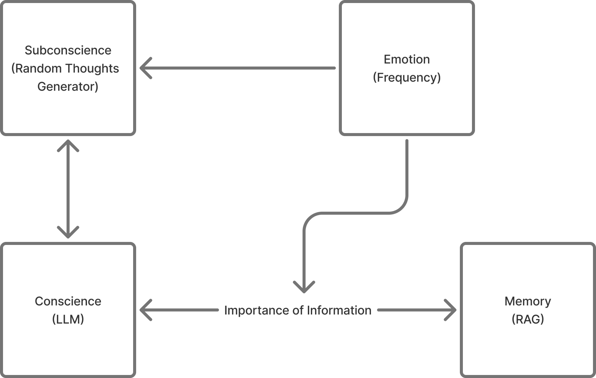
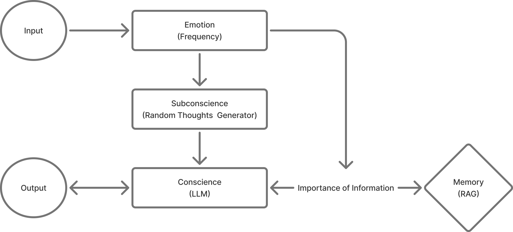

# How To Create AI with Emotion

This is still a thought in process and will be in the later stages of development. But I want to note down the foundmental hypothesis here.

Let's start from the human brain first.

We all know that we have conscious and subconscious mind, and we have emotions as well as rational thinking. So how do all these thing be connected and work together?

The conscious mind is what we think WE are, but it's major function is really to make sense of the world, comprehend the input information from our senses, and put them together into a reasonable story.

The subconscious mind is where all those random thoughts come from, and the place where we want to quiet in meditation. It's like an infinite random thoughts generator that keeps prompting the conscious mind.

Emotions are the feelings that we experience, but why do we need them? One of the key reasons why we need them might be to help the conscious mind to decide what to pay attention to and which information is important enough to be stored in our memory. Emotions are also tied with certain patterns of reactions to help our ancestors to survive in the wild.

This is how these components work together:

So how do these connected to the AI?

What if we replace the conscious mind with a LLM that can reason, such as DeepSeek R1, and equipped it with a RAG memory. What's missing here is the subconscious mind and the emotional mind.

The subconscious mind can be replaced with a small-size LLM that keeps generating random thoughts based on recent memory and the "emotion" of the it. When I say emotion, it can really just be colors (HSL) as the emotion is the hue in HSL, the intensity is the saturation, and the energy level is the lightness. The more intense an experience is, the more important it is to the subconscious mind which makes it a strong candidate to be stored in the memory.

I note "frequency" under the box of emotion in the graph as the fact that color is the frequency of the light, and sound is the frequency of the air vibration, both of which are deeply connected to human emotion.

## The Architecture of Conscious Mind

I think the emotion might be at the first laryer of reaction, as it's the quickest. The subconsciousness is the second layer as it's more basic compare with the conscience mind. the conscience mind is at the top level. All three layers of brains have access to memory

So it might look like this:

## TEST

Check out the test file [here](../emotional_ai_openai.py).
